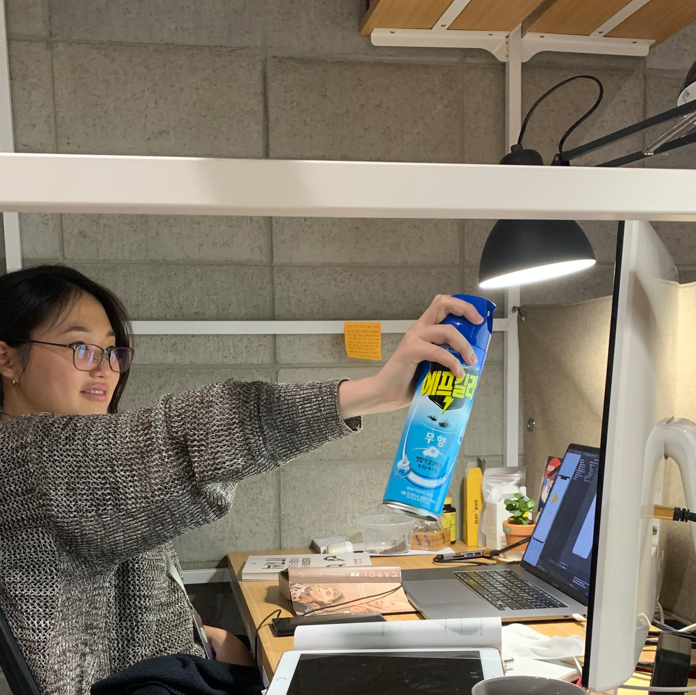

# Park Se Ran

👩‍🎓 Seoul Women's Univ. Information Security 

👩‍💻 **Client** Developer 📱📱📱

✔ Worked in **SOPT 26th** Android Part

 

> 벌레를 열심히 잡는편

---
🔭 I’m currently working as ...
- **SOPT 27th** iOS Part
- Android Developer for [Mongle](https://github.com/Sopt-Mongle/MongleAndroid_RELEASE)
- Discord Bot Developer for [ALGOALGO](https://github.com/ALGOALGO-swu/algoalgo-discord-bot)
    
🌱 I’m currently Studying ...
- [Android Jetpack && MVVM pattern](https://github.com/sery270/sunflower_clone)
- [Algorithm](https://github.com/sery270/Algorithm)
- [iOS Development](https://github.com/sery270/BoostCourseiOS)

🤔 I’m also interested in...
- iOS Development
---
|**Tech Skills**|**Links**|
|---|---|
|✏️ Java, Kotiln, Python, C/C++, HTML, CSS ... |📧 sery270@naver.com  |
|🛠 Visual Studio, Visual Code, Android Studio, Xcode, Pycharm, Firebase, Adobe XD, Adobe Premiere Pro, Adobe After Effects ... |📝 [https://boneup270.tistory.com/](https://boneup270.tistory.com/) |
|👩‍👩‍👧‍👦 Git/GitHub, Slack, Notion, Zeplin, Postman ... |📊 [https://sourcerer.io/sery270](https://sourcerer.io/sery270) |
